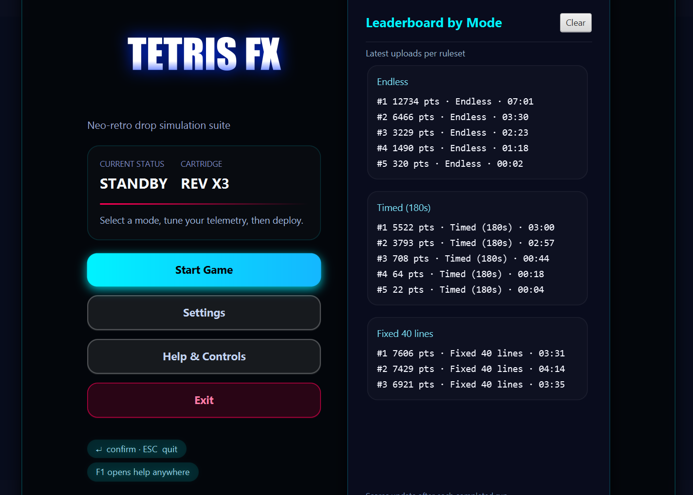
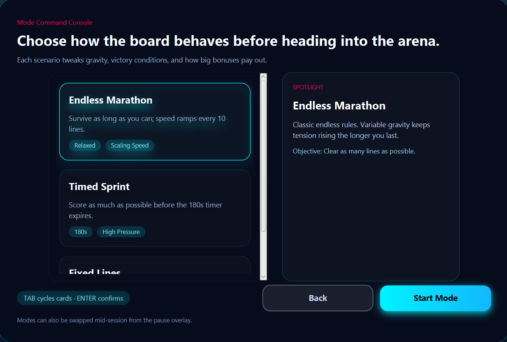
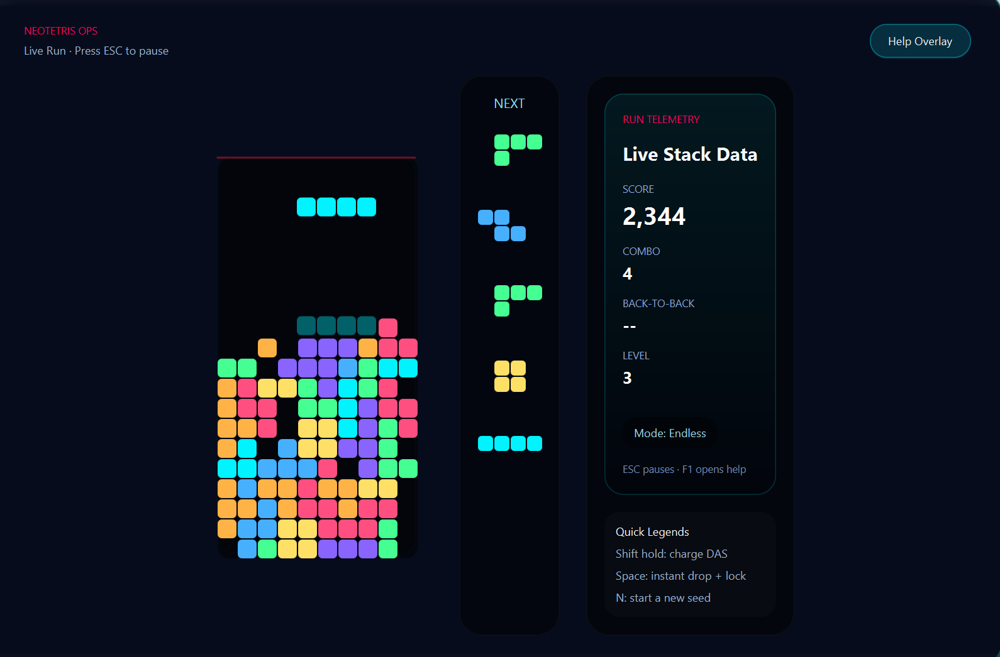
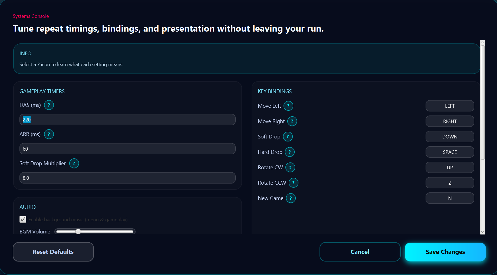
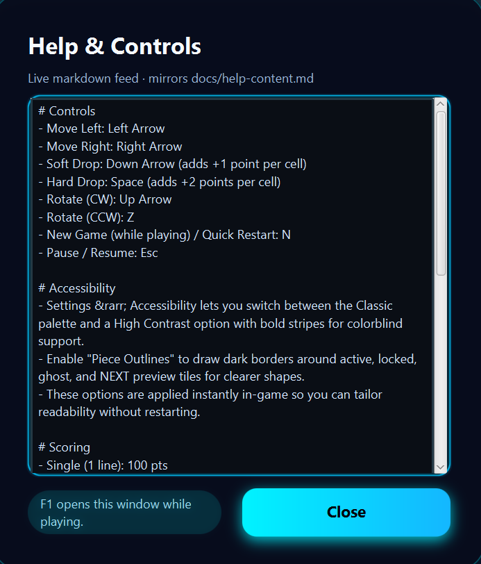
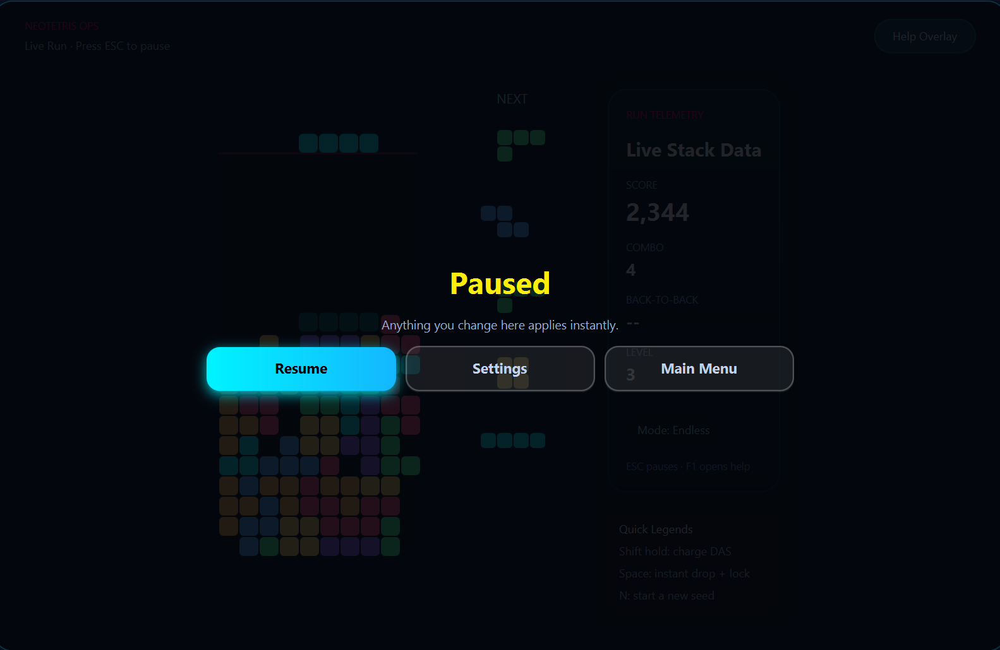
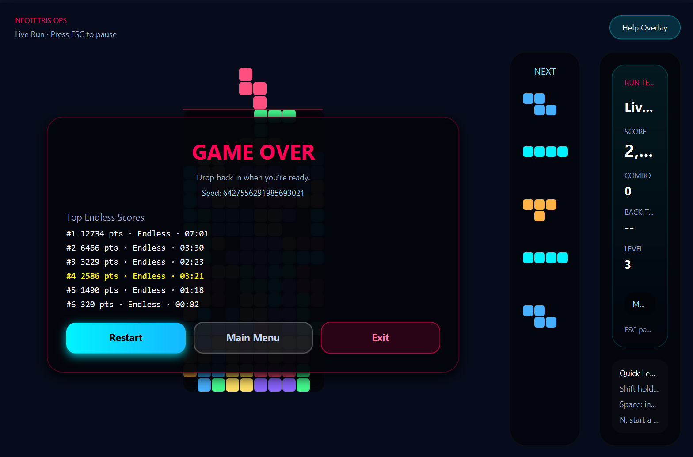

# COMP2042 Coursework: JavaFX Tetris

## GitHub
https://github.com/Pepper161/COMP2042_Kazuki_Ichikawa

## Compilation Instructions
To compile and run the application, ensure you have **Java JDK 23** (or later) installed.

1.  Open a terminal in the project root directory.
2.  Compile dependencies via:

    ```bash
    ./mvnw clean compile
    ```

3.  Launch the JavaFX client with:

    **Windows:**
    ```powershell
    .\mvnw.cmd clean javafx:run
    ```

    **Mac/Linux:**
    ```bash
    ./mvnw clean javafx:run
    ```

You can reproduce a specific bag order by passing `--seed=<signed-long>` to JavaFX (e.g. `./mvnw javafx:run -Dexec.args="--seed=12345"`). Invalid seeds fall back to random bags. Execute the automated tests with `./mvnw test`.

## Project Deliverables
In accordance with the coursework specification, this submission includes:
*   **`README.md`**: This file, documenting maintenance and extensions.
*   **`Design.pdf`**: A high-level class diagram of the final system structure.
*   **`Javadoc/`**: Generated HTML documentation for the source code.
*   **`Demo.mp4`**: A video demonstration of the refactoring and new features.


## Implemented and Working Properly
*   **7-Bag Randomizer**: A fairness algorithm that deals all 7 tetrominoes in a random permutation before repeating, preventing long droughts of specific pieces.
*   **Super Rotation System (SRS)**: Authentic rotation rules including wall kicks, allowing pieces to rotate into tight spaces.
*   **Ghost Piece**: A visual guide showing exactly where the current piece will land, improving placement accuracy.
*   **Next Queue (5 Pieces)**: Displays the next 5 upcoming tetrominoes, allowing players to plan ahead.
*   **HUD & Overlays**: `HudPanel` binds score, combo, back-to-back count, level, and mode badges; `NotificationPanel` shows transient combo popups; `GameOverPanel` surfaces run summaries with restart/main menu actions. The pause overlay (ESC) and seed banner keep session context visible.
*   **Guideline Scoring System**: Implements standard scoring for Singles, Doubles, Triples, Tetris, and T-Spins, including Back-to-Back bonuses and Combo multipliers.
*   **Level Progression & Modes**: Gravity speed increases every 10 lines cleared, following a standard difficulty curve driven by `LevelProgression`. Mode selection (Endless, Timed 180s, Fixed 40 Lines) in `ModeSelectController` adjusts objectives and HUD timers.
*   **Deterministic Seeds**: `Main` accepts `--seed=<long>` to replay/practice bags; `GuiController` surfaces the active seed in-game and on the Game Over overlay.
*   **Settings Dialog**: A comprehensive configuration menu to adjust DAS (Delayed Auto Shift), ARR (Auto Repeat Rate), Soft Drop speed, color assist, outlines, and audio volume/toggles.
*   **Key Remapping**: Fully customizable keyboard controls via the Settings dialog.
*   **High Score System**: Tracks the top scores per mode locally and feeds both the start menu leaderboards and the in-game Game Over overlay.
*   **Help & Controls Dialog**: An in-game guide explaining the rules and current control scheme.
*   **Audio System**: Background music and sound effects played through JavaFX `AudioClip`, with enable/disable and volume controls surfaced in Settings.

## Implemented but Not Working Properly
*   **None**: All implemented features are currently functioning as expected.

## Features Not Implemented
*   **Online Multiplayer**: Due to time constraints and the focus on refining the single-player core mechanics, network play was not implemented.
*   **Hold Piece Queue**: There is currently no hold/ swap mechanic; focus remained on core movement, scoring, and mode support.
*   **Replay Saving**: Aside from the `--seed` hint printed on Game Over, there is no run recording/replay export feature.

## New Java Classes
*   **`com.comp2042.app.SettingsController`**: Manages the Settings dialog UI and logic, handling user inputs for game configuration.
*   **`com.comp2042.app.HelpDialogController`**: Controls the Help dialog, displaying game instructions.
*   **`com.comp2042.config.GameSettings`**: An immutable data model that holds DAS/ARR values, soft-drop tuning, key bindings, color-assist/outline toggles, and BGM enable + volume sliders.
*   **`com.comp2042.config.GameSettingsStore`**: Handles the persistence of game settings to a local properties file (`~/.tetrisjfx/settings.properties` by default, overridable via `tetris.settings.dir`).
*   **`com.comp2042.config.ResourceManager`**: Centralizes resource loading (FXML, fonts, markdown, audio) to ensure robust path handling and error reporting.
*   **`com.comp2042.audio.BackgroundMusicManager`**: Manages the playback of looping themes and one-shot effects using JavaFX `AudioClip`, with master volume/enabled state mirroring the Settings dialog.
*   **`com.comp2042.ui.NextQueuePanel`**: A custom UI component responsible for rendering the preview of the next 5 pieces.
*   **`com.comp2042.ui.HudPanel`**: Displays real-time score, combo, back-to-back chains, the current level, and the active mode badge.
*   **`com.comp2042.app.ModeSelectController`**: Modal for picking Endless / Timed / Fixed Lines with card UI.
*   **`com.comp2042.app.HelpDialogService`**: Utility to show the F1/help dialog from any controller.
*   **`com.comp2042.game.GameConfig` / `GameState` / `LevelProgression` / `LineClearStats` / `LineClearType`**: Runtime configuration, mode tracking, gravity progression, and detailed scoring metadata.
*   **`com.comp2042.game.events.*`**: Strongly typed input events powering GUI -> logic communication.
*   **`com.comp2042.help.HelpContentProvider`**: Loads Markdown help content for the F1 dialog.
*   **`com.comp2042.ui.BrickColorPalette`**: Defines the standard color scheme for tetrominoes to ensure visual consistency across the board and UI panels.
*   **`com.comp2042.ui.anim.TetrisLogoView`**: Animated start-menu logo with glitch overlays.
*   **`com.comp2042.ui.input.AutoRepeatHandler`**: Implements the logic for DAS and ARR, handling key repeat behavior for smooth movement.
*   **`com.comp2042.logic.bricks.PieceGenerator`**: Implements the 7-Bag randomizer algorithm.
*   **`com.comp2042.game.stats.HighScoreEntry` / `HighScoreService`**: Persists mode-specific leaderboard rows (score, mode, duration, timestamp) under `~/.comp2042/highscores.dat` and exposes fetch/record helpers for UI panels.

## Modified Java Classes
*   **`com.comp2042.app.Main`**:
    *   **Changes**: Updated to initialize the `ResourceManager` and load the application with the new `StartMenuController`. Added command-line argument parsing for debug seeds.
    *   **Rationale**: Necessary to support the new FXML-based start menu and to allow deterministic testing via seed injection.
*   **`com.comp2042.app.StartMenuController`**:
    *   **Changes**: Added "Settings" and "Help" buttons and their corresponding event handlers to open the new dialogs.
    *   **Rationale**: Required to expose the new configuration and help features to the user from the entry point.
*   **`com.comp2042.game.GameController`**:
    *   **Changes**: Refactored to integrate the new `GameLogic`, `Score` system, deterministic seeds, and `InputEventListener`. Decoupled the game loop from the UI.
    *   **Rationale**: The original monolithic design made testing difficult. Separating the controller allows for a cleaner MVC architecture where game state is managed independently of the view.
*   **`com.comp2042.game.GameLogic`**:
    *   **Changes**: Rewritten to implement standard Tetris rules, including line clearing, locking, and T-Spin detection.
    *   **Rationale**: The original logic was incomplete and buggy. A dedicated logic class ensures adherence to standard Tetris guidelines and simplifies unit testing.
*   **`com.comp2042.board.SimpleBoard`** / **`Board`** / **`MatrixOperations`** / **`ViewData`** / **`ClearRow`**:
    *   **Changes**: Extended to support the ghost piece, drop distance, next queue capture, and safer collision handling.
    *   **Rationale**: "Lookahead" features like the Ghost Piece and Next Queue required non-destructive access to the board state, which the original `Board` class did not support.
*   **`com.comp2042.ui.GuiController`**:
    *   **Changes**: Major refactoring to handle the game loop (Timeline), input delegation to `AutoRepeatHandler`, pause overlay, deterministic seed display, and integration of new UI panels (`HudPanel`, `NextQueuePanel`).
    *   **Rationale**: To provide a smoother 60FPS experience and responsive controls (DAS/ARR), the rendering loop needed to be decoupled from the logic loop.
*   **`com.comp2042.board.BrickRotator`**:
    *   **Changes**: Updated to implement the full Super Rotation System (SRS) kick tables for all piece types.
    *   **Rationale**: The original rotation was basic and often caused pieces to get stuck. SRS is the standard for modern Tetris and improves gameplay flow.
*   **`com.comp2042.Score`**:
    *   **Changes**: Enhanced to track combos, back-to-back streaks, and expose JavaFX properties for HUD bindings.
    *   **Rationale**: To support the new HUD and scoring rules, the score object needed to be observable by the UI.
*   **`com.comp2042.NotificationPanel` / `GameOverPanel`**:
    *   **Changes**: Reworked animations and layouts to support combo popups and seeded leaderboard overlays.
    *   **Rationale**: Enhances player feedback and provides a polished end-of-game experience.
*   **`com.comp2042.board.MatrixOperations`**:
    *   **Changes**: Safe handling of rectangular piece matrices (prevents crashes on future pieces).
    *   **Rationale**: Prevents `ArrayIndexOutOfBoundsException` when dealing with non-square matrices, improving stability.

## Key Changes at a Glance

| Change Type | Location(s) | Reason / Impact |
| --- | --- | --- |
| Extension | `GameConfig`, `ModeSelectController`, `GuiController`, `HudPanel` | Adds Endless / Timed / Fixed Lines, timers, and seed banners to broaden gameplay modes. |
| Extension | `PieceGenerator`, `BrickRotator`, `SimpleBoard`, `NextQueuePanel` | Implements guideline 7-bag, SRS kicks, ghost/next queue to match Tetris standards. |
| Extension | `SettingsController`, `GameSettings*`, `AutoRepeatHandler`, `BackgroundMusicManager` | Exposes DAS/ARR/SDF, color assist, outlines, and audio toggles for accessibility. |
| Maintenance | `MatrixOperations`, `ClearRow`, `ViewData` | Hardened collision/merge logic to support rectangular matrices and avoid out-of-bounds errors. |
| Maintenance | `GameController`, `GameLogic`, `Score`, `NotificationPanel` | Refactors the gameplay loop for deterministic seeds plus combos/back-to-back/T-Spin detection. |
| Maintenance | `HighScoreService`, `StartMenuController`, `GameOverPanel` | Adds durable per-mode leaderboards shared between the start menu and game-over overlay. |

## Screenshots

### Start Menu & Leaderboard

The main entry point featuring the animated logo, mode selection, and a persistent leaderboard showing top scores for each mode.

### Mode Selection

A dedicated console for choosing between Endless, Timed (180s), and Fixed Lines (40 Lines) modes.

### Gameplay Interface

The core gameplay view showing the board, ghost piece, next queue (right), and HUD stats (left) including score, combo, and level.

### Settings Menu

Comprehensive configuration for gameplay tuning (DAS, ARR, Soft Drop), audio controls, and accessibility options (Color Assist, Outlines).

### Help & Controls

In-game reference guide explaining controls, scoring rules, and special mechanics like T-Spins and Wall Kicks.

### Pause Overlay

The pause menu overlay that halts the game loop, allowing players to resume, restart, or return to the main menu.

### Game Over & Results

The summary screen displaying the final score, run statistics, and updated leaderboard rankings.

## Unexpected Problems
*   **Background Grid Visibility**: The default background grid pattern made the text in the Settings and Help dialogs difficult to read.
    *   **Resolution**: I modified the CSS (`window_style.css`) to explicitly remove the background image (`-fx-background-image: null`) and apply a solid dark background color (`rgb(8, 12, 24)`) for these specific dialogs, ensuring high contrast and readability.
*   **FXML Stylesheet Loading**: Initially, the new dialogs (Settings, Help) were not picking up the global styles.
    *   **Resolution**: I ensured that the `window_style.css` was correctly linked in the `<stylesheets>` section of the FXML files and used the `ResourceManager` to resolve the path reliably.
*   **Audio / Resource Fallbacks**: Missing audio assets now log warnings in `BackgroundMusicManager` instead of crashing, and invalid `--seed` parameters fall back to random bags with a console notice.

## Testing and Documentation
*   **Automated tests**: `./mvnw test` executes the JUnit 5 suite (9 test classes across `board`, `config`, `game`, `logic`, and `stats` packages) to verify matrix math, line clears, generators, and persistence helpers before each submission.
*   **Design diagram**: `Design.pdf` (exported from `docs/design/Design.puml`) summarizes the final class structure. Include it alongside this README when preparing the submission folder/zip.
*   **Javadoc**: Generate via `./mvnw javadoc:javadoc`; the HTML output is produced under `target/site/apidocs/` and must be copied into the top-level `Javadoc/` directory for the final package.
*   **Internal notes**: Architecture and persistence references live under `docs-local/`, including the class diagram spec at `docs-local/design/class-diagram-spec.puml` and storage rationale under `docs-local/persistence/`.
